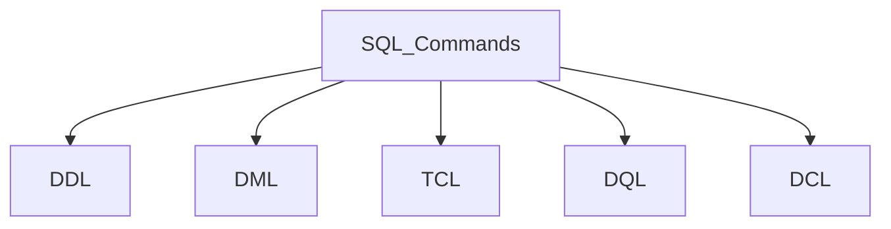
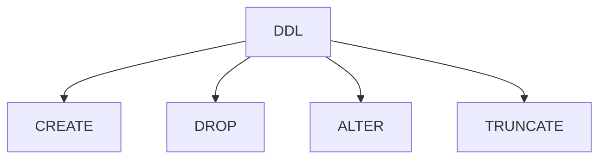
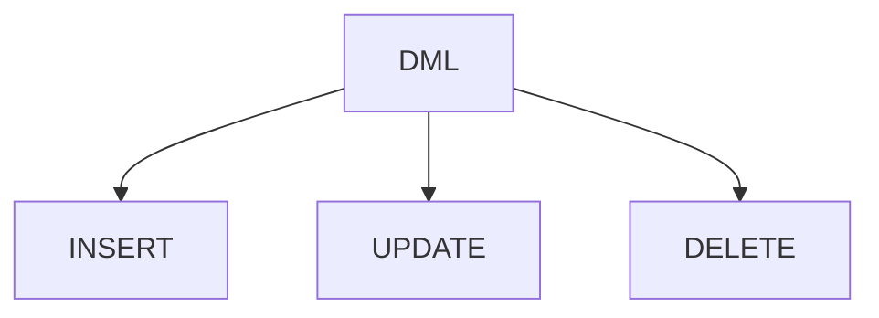
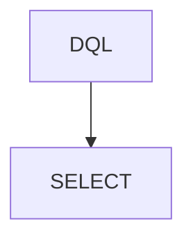

<code>RELATIONAL DATABASE</code> <code>SQL</code> <code>PostgreSQL</code> <code>FreeCodeCamp</code>

<h1>Relational Database Workshop Notes</h1>

<p>Personal notes made while creating a Relational Database in a FreeCodeCamp Workshop using PostgreSQL.</p>

<h2>PostgreSQL</h2>
<p><bold>PostgreSQL</bold> is an object-relational database management system that utilizes the SQL language.</p>
<p><bold>PSQL</bold> is a powerful interactive terminal for working with the PostreSQL database.</p>

<h2>PSQL commands in PostgreSQL</h2>

<table>
  <caption>
    PSQL Commands used
  </caption>
  <thead>
    <tr>
      <th>Command</th>
      <th>Description</th>
    </tr>
  </thead>
  <tbody>
    <tr>
      <td>psql --username=freecodecamp --dbname=postgres</td>
      <td>Connects to a database under a specific user</td>
    </tr>
    <tr>
      <td>\l</td>
      <td>List all available databases</td>
    </tr>
    <tr>
      <td>\c database_name</td>
      <td>Switch connection to a new database</td>
    </tr>
    <tr>
      <td>\d</td>
      <td>Display relations/Tables of the current database</td>
    </tr>
    <tr>
      <td>\d table_name</td>
      <td>Describe details about the table such as columns, types, modifiers, etc.</td>
    </tr>
  </tbody>
</table>

<h2>SQL - Structured Query Language</h2>
<p><bold>SQL</bold> is a programming language for managing and manipulating data in relational database management systems (RDBMS).</p>



<p>In this Workshop were used three different types of SQL commands:</p>
<ul>
  <li>DDL - Data Definition Language</li>
  <li>DML - Data Manipulation Language</li>
  <li>DQL - Data Query Language</li>
</ul>
<p>In addition to these SQL types of commands, there are also the following ones, for informational purposes only.</p>
<ul>
  <li>DCL - Data Control Language</li>
  <li>TCL - Transaction Control Languange</li>
</ul>

<h3>Data Definition Language (DDL)</h3>
<p>These commands are used to define or modify the database schema or structure.</p>



<h4>DATABASES</h4>

```sql
CREATE DATABASE database_name; --Creates a new Database.
```
```sql
ALTER DATABASE database_name RENAME TO new_db_name; --Rename database.
```
```sql
DROP DATABASE database_name; --Drop a database.
```

<h4>TABLES</h4>
<h5>CREATE TABLE</h5>

```sql
CREATE TABLE table_name();      --Create Table

CREATE TABLE table_name(        --Create Table with columns
  column1 DATA_TYPE CONSTRAINT,
  column2 DATA_TYPE CONSTRAINT,
  column3 DATA_TYPE CONSTRAINT
);
```
<h5>ALTER TABLE</h5>

```sql
--Set Primary Key to
ALTER TABLE table_name ADD PRIMARY KEY(column_name);  
```
```sql
--Composite Primary Key
ALTER TABLE table_name ADD PRIMARY KEY(column1,column2); 
```
```sql
--Create and set a new column as Foreign Key
ALTER TABLE table_name ADD COLUMN DATA_TYPE REFERENCES referenced_table_name(referenced_column_name); 
```
```sql
--Set an existing column as Foreign Key
ALTER TABLE table_name ADD FOREIGN KEY(column_name) REFERENCES referenced_table(referenced_column);
```
```sql
--Set a UNIQUE constraint to a column
ALTER TABLE table_name ADD UNIQUE(column_name); 
```
```sql
--Set column constraint
ALTER TABLE table_name ALTER COLUMN column_name SET CONSTRAINT;
```
```sql
--Drop column constraint
ALTER TABLE table_name DROP CONSTRAINT constraint_name; 
```
```sql
--Remove a column
ALTER TABLE table_name DROP COLUMN; 
```
```sql
--Rename column
ALTER TABLE table_name RENAME COLUMN column_name TO new_column_name; 
```

<h5>DROP TABLE</h5>

```sql
DROP TABLE table_name; --Drop table from Database
```

<h3>Data Manipulation Language (DML)</h3>



```sql
INSERT INTO table_name(column1, column2) --Insert values in table
  VALUES(value1,value2),
        (value3,value4);
```
```sql
UPDATE table_name SET column_name=new_value WHERE condition; --Change record\value by WHERE condition;
```
```sql
DELETE FROM table_name WHERE condition;
```

<h3>Data Query Language (DQL)</h3>


```sql
SELECT * FROM table_name; --Use * to denote all the table's column
```
```sql
SELECT column1, column2, FROM table_name ORDER BY column_name;
```
<h2>DATA TYPES</h2>
<h3>NUMERIC</h3>
<table>
  <thead>
    <tr>
      <th>TYPE</th>
      <th>DESCRIPTION</th>
      <th>RANGE</th>
    </tr>
  </thead>
  
  <tbody>
    <tr>
      <td>INT</td>
      <td>Standard integer values</td>
      <td>-2,147,483,648 to 2,147,483,647</td>
    </tr>
    <tr>
      <td>NUMERIC(num1,num2)</td>
      <td>Used for precision data. Defines fixed-point decimal number, with total of <bold>num1</bold><u> represents the maximum total number of digits that can be stored</u>, both to the left and to the right of the decimal point, and <bold>num2</bold>, <u>represents the maximum number of digits allowed to the right of the decimal point</u> (scale)</td>
      <td>-10<sup>38</sup>+1 to 10<sup>38</sup>-1</td>
    </tr>
  </tbody>
</table>

<h3>STRING</h3>
<table>
  <thead>
    <tr>
      <th>DATA TYPE</th>
      <th>DESCRIPTION</th>      
    </tr>
  </thead>
  <tbody>
    <tr>
      <td>CHAR</td>
      <td>The maximum length of 8000 characters. (Fixed-Length non-Unicode Characters)</td>
    </tr>
    <tr>
      <td>VARCHAR(max_lenght)</td>
      <td>The maximum length of 2<sup>31</sup> - 1 characters(SQL Server 2005 only). (Variable Length non-Unicode data)</td>
    </tr>
    <tr>
      <td>TEXT</td>
      <td>The maximum length of 2,127,483,647 characters(Variable Length non-Unicode data)</td>
    </tr>
  </tbody>
</table>

<h3>DATE/TIME</h3>
<table>
  <thead>
    <tr>
      <th>DATA TYPE</th>
      <th>DESCRIPTION</th>
      <th>STORAGE SIZE</th>
    </tr>
  </thead>
  <tbody>
    <tr>
      <td>DATE</td>
      <td>Stores the data of date ('YYYY-MM-DD')</td>
      <td>3 Bytes</td>
    </tr>
    <tr>
      <td>TIME</td>
      <td>Stores the data of time (hour, minute,second)</td>
      <td>3 Bytes</td>
    </tr>
    <tr>
      <td>DATETIME</td>
      <td>Store both the data and time (year, month, day, hour, minute, second)</td>
      <td>8 Bytes</td>
    </tr>
  </tbody>
</table>

<p>There is also the <strong>BOOLEAN</strong> type to store logical values.</p>

<h3>PESUDO TYPE</h3>
<h4>SERIAL</h4>
<p>The <bold>SERIAL</bold> pseudo-type allows you to an auto-incrementing integer column, typically used for primary keys. It adds a NOT NULL constraint because the sequence values are always non-null.</p>

<h2>CONSTRAINTS</h2>

<table>
  <thead>
    <tr>
      <th>CONSTRAINT</th>
      <th>DESCRIPTION</th>
    </tr>
  </thead>
  <tbody>
    <tr>
      <td>NOT NULL</td>
      <td>It ensures that a column cannot contain NULL values.</td>
    </tr>
    <tr>
      <td>UNIQUE</td>
      <td>ensures that all values in a column are distinct across all rows in a table. Unlike the PRIMARY KEY, which requires uniqueness and does not allow NULLs, the UNIQUE constraint allows NULL values but still enforces uniqueness for non-NULL entries.</td>
    </tr>
    <tr>
      <td>PRIMARY KEY</td>
      <td>is a combination of the NOT NULL and UNIQUE constraints. It uniquely identifies each row in a table. A table can only have one PRIMARY KEY, and it cannot accept NULL values.</td>
    </tr>
    <tr>
      <td>FOREIGN KEY</td>
      <td>It links a column in one table to the primary key in another table.</td>
    </tr>
  </tbody>
</table>

<h2>REFERENCES</h2>
<ul>
  <li>IBM: <a href="https://www.ibm.com/think/topics/structured-query-language#:~:text=Authors,city%20=%20'New%20York'%20;">What is Structured Query Language (SQL)?</a></li>
  <li>GeeksForGeeks: <a href="https://www.geeksforgeeks.org/sql/sql-ddl-dql-dml-dcl-tcl-commands/">SQL Commands</a></li>
  <li>GeeksForGeeks: <a href="https://www.geeksforgeeks.org/postgresql/postgresql-psql-commands/">PostgreSQL - Psql commands</a></li>
  <li>GeeksForGeeks: <a href="https://www.geeksforgeeks.org/postgresql/postgresql-primary-key/">PostgreSQL - Primary Key</a></li>
  <li>GeeksForGeeks: <a href="https://www.geeksforgeeks.org/postgresql/postgresql-serial/">PostresSQL - SERIAL</a></li>
</ul>
