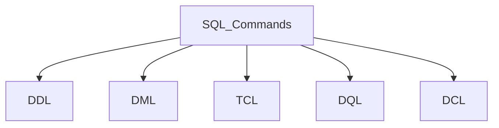
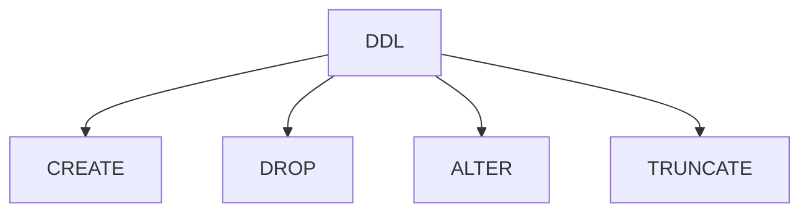
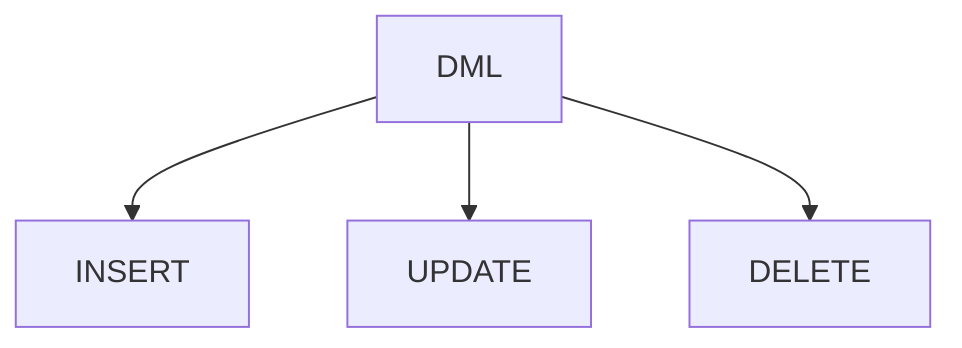
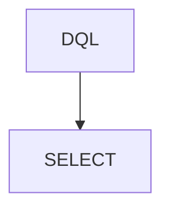

<code>RELATIONAL DATABASE</code> <code>SQL</code> <code>PostgreSQL</code> 

<h1>Relational Database Workshop Notes</h1>

<p>Personal notes made while creating a Relational Database in a FreeCodeCamp Workshop using PostgreSQL.</p>

<h2>PostgreSQL</h2>
<p><bold>PostgreSQL</bold> is an object-relational database management system that utilizes the SQL language.</p>
<p><bold>PSQL</bold> is a powerful interactive terminal for working with the PostreSQL database.</p>

<h2>PSQL commands in PostgreSQL</h2>

<table>
  <caption>
    PSQL Commands used
  </caption>
  <thead>
    <tr>
      <th>Command</th>
      <th>Description</th>
    </tr>
  </thead>
  <tbody>
    <tr>
      <td>psql --username=freecodecamp --dbname=postgres</td>
      <td>Connects to a database under a specific user</td>
    </tr>
    <tr>
      <td>\l</td>
      <td>List all available databases</td>
    </tr>
    <tr>
      <td>\c database_name</td>
      <td>Switch connection to a new database</td>
    </tr>
    <tr>
      <td>\d</td>
      <td>Display relations/Tables of the current database</td>
    </tr>
    <tr>
      <td>\d table_name</td>
      <td>Describe details about the table such as columns, types, modifiers, etc.</td>
    </tr>
  </tbody>
</table>

<h2>SQL - Structured Query Language</h2>
<p><bold>SQL</bold> is a programming language for managing and manipulating data in relational database management systems (RDBMS).</p>



<p>In this Workshop were used three different types of SQL commands:</p>
<ul>
  <li>DDL - Data Definition Language</li>
  <li>DML - Data Manipulation Language</li>
  <li>DQL - Data Query Language</li>
</ul>
<p>In addition to these SQL types of commands, there are also the following ones, for informational purposes only.</p>
<ul>
  <li>DCL - Data Control Language</li>
  <li>TCL - Transaction Control Languange</li>
</ul>

<h3>Data Definition Language (DDL)</h3>
<p>These commands are used to define or modify the database schema or structure.</p>



<h4>DATABASES</h4>

```sql
CREATE DATABASE database_name; --Creates a new Database.
```
```sql
ALTER DATABASE database_name RENAME TO new_database_name; --REname database.
```
```sql
DROP DATABASE database_name; --Drop a database.
```

<h4>TABLES</h4>

<h3>Data Manipulation Language (DML)</h3>


<h3>Data Query Language (DQL)</h3>


<h2>REFERENCES</h2>
<ul>
  <li><a href="https://www.geeksforgeeks.org/postgresql/postgresql-psql-commands/">GeeksForGeeks: PostgreSQL - Psql commands</a></li>
  <li><a href="https://www.ibm.com/think/topics/structured-query-language#:~:text=Authors,city%20=%20'New%20York'%20;">IBM: What is Structured Query Language (SQL)?</a></li>
  <li><a href="https://www.geeksforgeeks.org/sql/sql-ddl-dql-dml-dcl-tcl-commands/">GeeksForGeeks: SQL Commands</a></li>
</ul>
